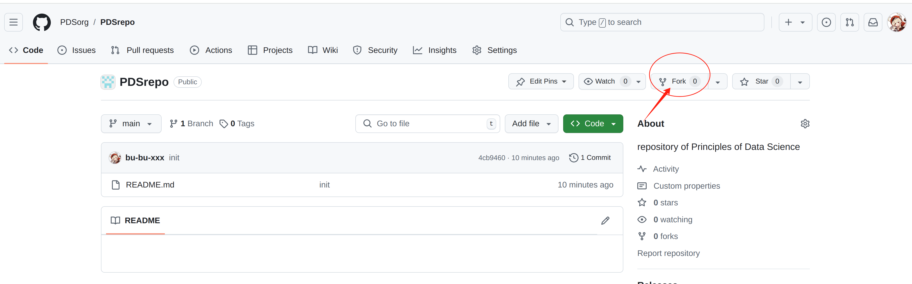
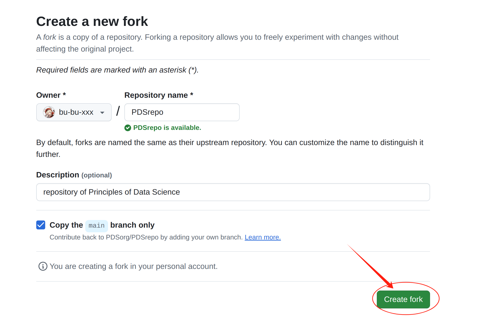
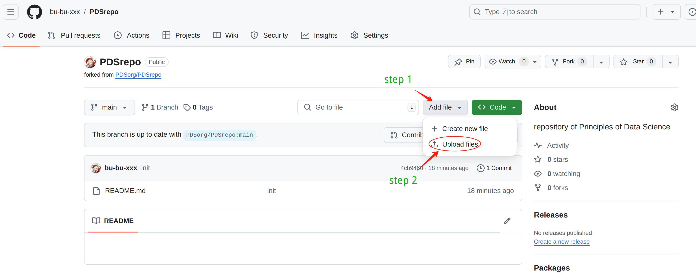
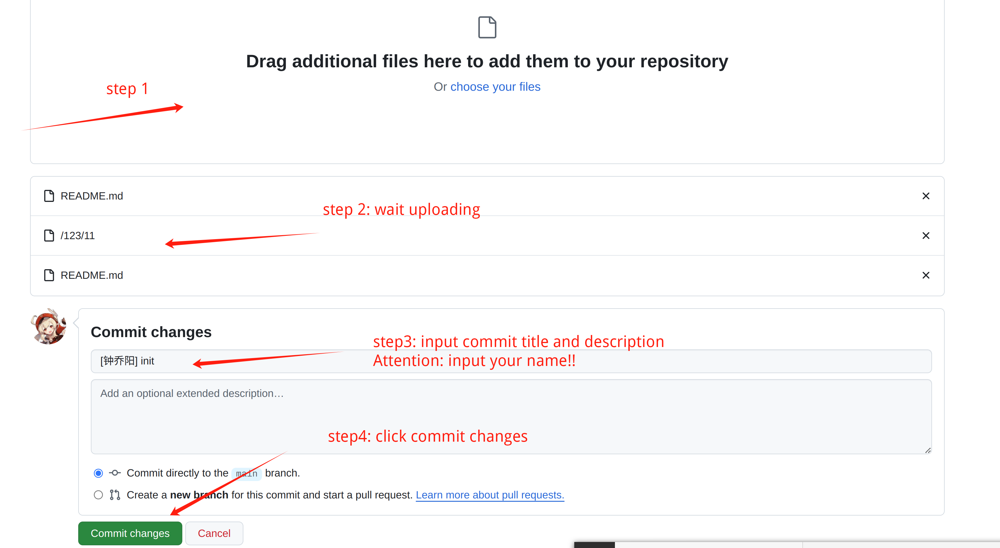
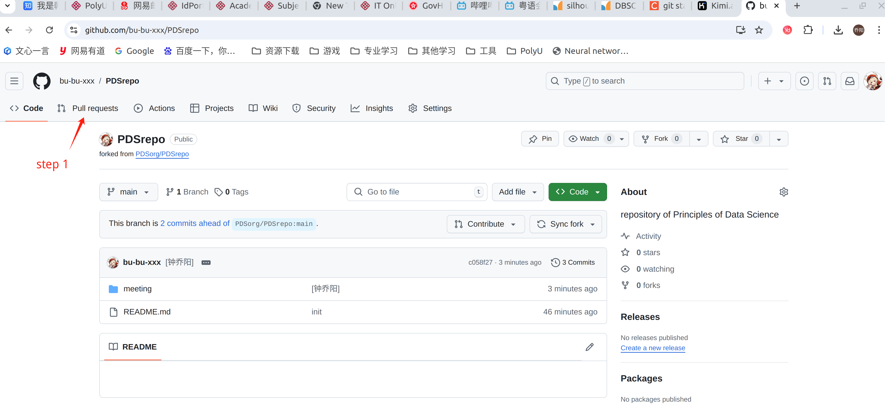
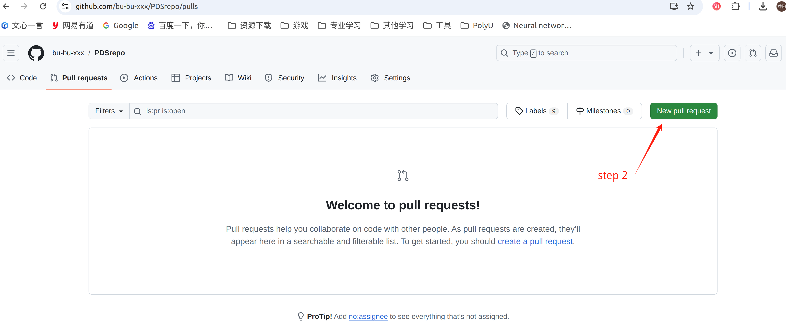
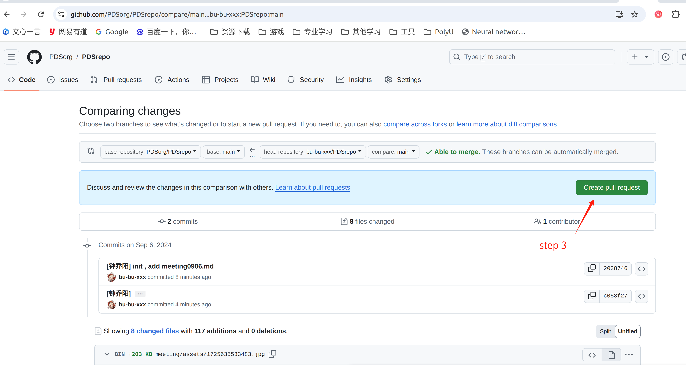
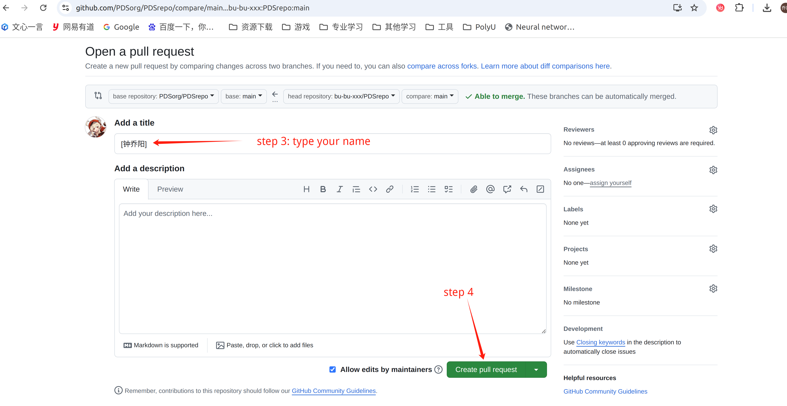
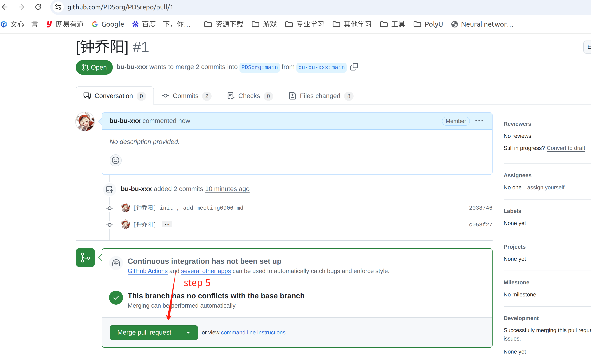

# fork私仓

打开<https://github.com/PDSorg/PDSrepo>

注：`PDSorg`是`Principles of Data Science organization`缩写，是我们的organization；`PDSrepo`是`PDS repository`的缩写，是我们提交代码、文件的仓库，我们称为**公仓**

点击`fork`，这样你的主页里`repository`就有一个同名的仓库，称为**私仓**





例如我的私仓就是<https://github.com/bu-bu-xxx/PDSrepo>，以后我们先上传到私仓，再提交MR,合并到公仓，我们平时分享资料在公仓，私仓自己学着怎么耍都可以。

# 提交commit到私仓

## website操作(适合新手)

先打开私仓，`upload files`



直接拖拽修改或添加的文件



私仓提交commit完成！

注意名字要写上，其他随意

## command line 操作

（待补充）

```shell
# clone 公仓 https://github.com/PDSorg/PDSrepo
# 建议公仓起名为origin,私仓随意
git clone https://github.com/PDSorg/PDSrepo

# git remote add 你的私仓
# 从公仓更新内容
git fetch orgin 
git rebase origin/master

# push到私仓
git add .
git commit 
git push <私仓>

```


# 合并私仓commit到公仓

> 注意：这一步只能website 操作

打开私仓













congratulations!!!

# FAQ

* 第一次用CL(命令行)进行`git push`需要登陆帐号密码，建议google一下ssh验证方式，方便下次`git push`免密码