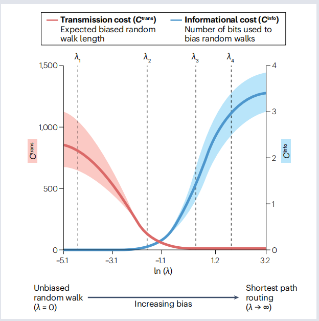

### 网络通信成本的三个维度
1. 延迟（delay）
2. 信息（information） 
3. 能量（energy）

理性的模型将实现快速通信和经济信号传输，并依赖于适合去中心化系统的知识假设——低延迟、能源和信息成本。权衡三个维度

### A taxonomy of brain network communication models and measures 脑网络通信模型和测量分类
#### Routing protocols
1. Shortest path routing（最短路径）
缺点：需要极高的信息成本，很难在分散的神经网络中实施。

2. Navigation 
去中心化路由协议 不要求单个节点拥有网络拓扑的全局知识
从源节点开始，每个节点将信号转发到距离目标最近的邻居，也被称为**贪恋路由**  
缺点：可能陷入节点之间的循环之中，无法达到预期目标
需要以距离指标为指导，该指标反应节点对形成的概率，简单方法考虑欧几里得距离。还有就是**信息成本**，但是低于最短路径路由

3. 综合下来，路由协议有较低的能量和延迟，但要高的信息成本，但navigation比最短路径路由Shortest path routing更生物现实路由策略。

##### BOX1
1. 最短路径测量通常用作评估模型的相对效率基准（benchmark）

#### Diffusion processes
该系列模型受益于低信息成本，但受较高的信号延迟和能量成本影响。

1. Random walks
从源节点开始的信号被传输到随机选择的邻居，其概率与它们的连接权重成正比。随机信号传播导致游走明显长于最短路径，它的低信息成本是以更高的延迟和精力成本为代价的。

通过投入

2. Broadcasting
信号会同时传播到多个节点。
从一个源开始，区域始终将信号传播到其所有相邻区域

#### Parametric measures 
参数模型这族模型的定义特征是它们的行为由一个可调参数控制，该参数是沿着可能值的连续体定义的。在这个频谱的任何一端，参数值通常通过路由或扩散来近似于通信，而中间值则实现了混合策略。仔细的参数调整可能导致复合策略，在延迟、信息和能量成本之间达成有利的权衡，而这些是从路由和扩散的相反角度无法获得的。

1. Linear threshold model.

在任何给定的时间点，节点被建模为处于“活动”或“非活动”状态，第一个状态表示扰动已经传播到的网络元素。

设置θ = 0实现了一个广播过程，在这个过程中，信号总是被传播到活动节点的所有邻居。在这种情况下，任何节点的扰动都会导致激活快速扩散到包含整个网络，称为完全级联。随着θ的增加，传播需要更大的节点邻近区域的活动比例，级联变得更慢、更小。临界值θc是对单个节点的任何扰动都会导致完全级联的最大阈值。超过这一点，信号就越来越局限于源的附近。

可以认为线性阈值模型具有中等的能量成本，并在扩散模型和路由模型之间占据一个中间地带.

2. Biased random walks.

在这个模型中，一个参数λ控制了对单个节点可用的全局拓扑信息的数量。对于λ = 0，不引入偏差，节点只能访问它们自己的连接权值；因此，通信通过无偏随机游动进行。增加的λ会逐步引导人们沿着有效的路线行走。这是通过赋予节点关于哪些节点的邻居更有可能在到达期望目标的最短路径上的信息来实现的，并使转移概率偏向于选择这个邻居。在λ→∞的极限下，有偏随机游动收敛于最短路径路由，过渡到最短路径外的任何节点的概率消失为零。

该模型在通信成本维度上的性能完全依赖于λ的值。更重要的是，该模型提供了一种灵活的方法来探索大脑网络中的通信动态，其中λ的系统变化允许对延迟和信息成本之间的权衡进行定量分析

3. Shortest path ensembles
最短路径集合模型提出，信号通过包含k个连接两个节点的最有效路径的集合在两个节点之间传递。传统的最短路径路由对应于特定情况k = 1，信号只利用节点之间最有效的路径。

对于较小的k值，在节点对之间识别k个最有效的路径仍然严重依赖于全局拓扑知识。然而，路径集合变得很大，并且包含了k远大于1，它们的构建需要更低的信息成本。同样，信号沿多条路径传输所需的能量成本与k的选择成正比。考虑到可能存在的k的全谱，最短路径集成模型Shortest path ensembles的特点是具有低传输延迟和平均中等的信息和能量成本。
##### BOX3

激活时间是线性阈值模型的主要通信度量。它量化了在向网络传递扰动后两个节点激活之间的延迟。结合阈值模型的可调参数，这个简单的测量可以用来模拟复杂的扩散动力学，并在实用的计算和经验的神经级联研究中发现了效用。

有偏差的随机游动产生了一个连续的通信策略，使定量分析延迟和信息成本之间的交易。直观地说，经验连接体分析显示，增加λ（节点可用的全局信息量）会导致平均信息成本的单调增加，以及跨节点对的平均传输延迟的减少。然而，重要的是，这两种成本的变化率并不相同，λ值的范围狭窄，同时实现了低信息成本和延迟成本。这表明，连接体拓扑结构可能会被组织起来，因此引入微妙的偏差因素可能会在沟通能力方面获得不成比例的巨大收益。

###  current research
R： the strength of stimulus-evoked responses 
刺激诱发反应的强度(R)

搜索信息（中心）与无偏随机游走沿着其最短路径从源节点移动到目标节点的概率有关，该值由组成该路径的节点的局部连通性决定。因此，搜索信息不仅对网络的最短路径结构很敏感，而且对局部拓扑特征也很敏感。在脑刺激的背景下，搜索信息可以被解释为刺激在刺激和目标部位之间分散的倾向。尽管A、B和C与T的最短路径长度相同，但搜索信息预测了RCT > RBT > RAT。可通信性（右）考虑到通过所有网络行走的广播。它索引了节点可以通过多种备选路由进行通信的程度，其中短路径的贡献超过了长路径。在这里，尽管A和B到T的最短路径长度相同，可通信性预测RAT > RBT，因为A有更多的短路径到T。

在直接电刺激后，网络通信措施与经验观察到的响应振幅之间的相关性。从解剖学上不连接的部位之间的颅内脑电图记录中推断出诱发反应。搜索信息和可沟通性比最短路径效率更能解释刺激传播的差异，从而为了解白质连接的什么特征塑造了人脑中的多突触通信提供了见解。

### 发展
纳入时间分辨通信动力学是未来研究的一个有前途的方向。