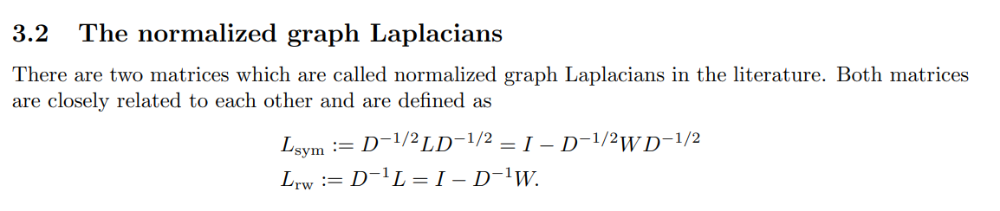
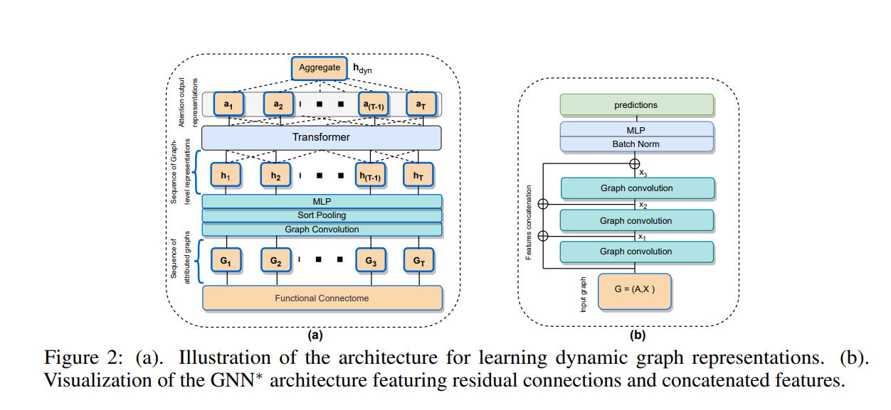
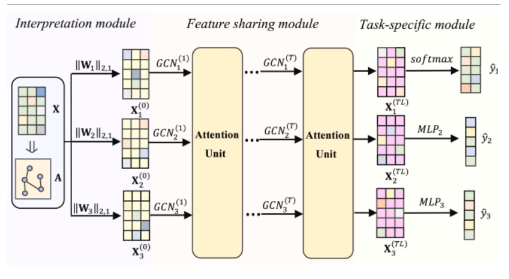
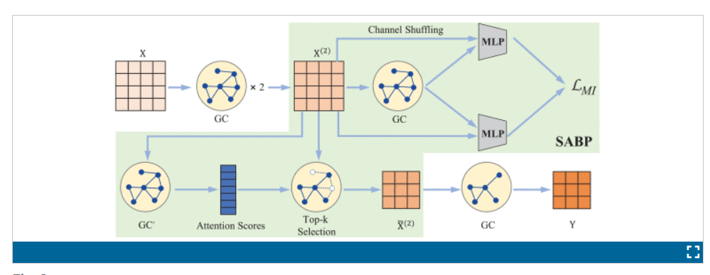

# GNN & GCN

* A Gentle Introduction to Graph Neural Networks

<https://distill.pub/2021/gnn-intro/>

<https://distill.pub/2021/understanding-gnns/>

**random walk method**

<https://doi.org/10.1145/2939672.2939754>

<https://doi.org/10.1145/2623330.2623732>

* ChebNet  (ancestor)

how to create adjacent matrix: <https://arxiv.org/pdf/0711.0189> （spectral clustering)

- Graph Convolutional Networks (GCN)
- Graph Attention Networks (GAT)
- Graph Sample and Aggregate (GraphSAGE)
- Graph Isomorphism Network (GIN)

# Brain with GNN

* NeuroGraph: Benchmarks for Graph Machine
  Learning in Brain Connectomics

<https://www.arxiv.org/abs/2306.06202>

partial correlation, Pearson correlation, and geometric distances , ,defining edges within brain graphs

definition of edge , node, graph, representation... in static and dynamic of fMRI

datasets

# graph convolution layer

<https://arxiv.org/abs/1710.10903>

keras

# papers

* A comparative study of GNN and MLP based machine learning for the diagnosis of Alzheimer’s Disease involving data synthesis

<https://www-sciencedirect-com.ezproxy.lb.polyu.edu.hk/science/article/pii/S0893608023006020?via%3Dihub>

The edges are undirected and established for the nodes which are adjacent to each other **based on the AAL3 atlases**. 

-------------------------

* Attention based multi-task interpretable graph convolutional network for Alzheimer’s disease analysis

<https://www-sciencedirect-com.ezproxy.lb.polyu.edu.hk/science/article/pii/S0167865524000497?via%3Dihub>

Interpretation module: can interpret which feature get high impact to the classification, like trainable mask mechanism.

* LGGNet: Learning from Local-Global-Graph Representations for Brain-Computer Interface

<https://arxiv.org/pdf/2105.02786v3>

 refined the graph topology by incorporating the dynamically learned connection weights based on attention and gating mechanisms   ||||  Lian et al. [41] 

Zhong et al. [24] defined the adjacency matrix according to the spatial distance and added some global connections according to asymmetry in neuronal activities

* Classification of Brain Disorders in rs-fMRI via Local-to-Global Graph Neural Networks

<https://ieeexplore.ieee.org/document/9936686/authors#authors>

pooling mechanism, residual , GAT, adaptive weight aggregation block (AWAB) , avoid over-smoothing

