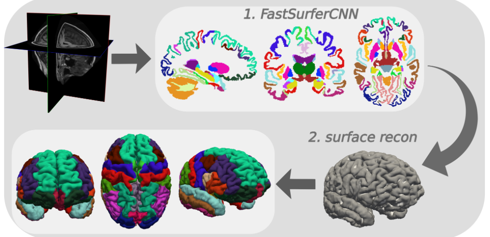

[A comparative study of GNN and MLP based machine learning for the diagnosis of Alzheimer’s Disease involving data synthesis](https://www-sciencedirect-com.ezproxy.lb.polyu.edu.hk/science/article/pii/S0893608023006020?via%3Dihub)

# CNN GCN

[Classification of Brain Disorders in rs-fMRI via Local-to-Global Graph Neural Networks](https://ieeexplore.ieee.org/document/9936686)

[BrainGNN: Interpretable Brain Graph Neural Network for fMRI Analysis](https://www-sciencedirect-com.ezproxy.lb.polyu.edu.hk/science/article/pii/S1361841521002784?via%3Dihub)

# youtube

* <https://www.youtube.com/watch?v=vkvBL_0G4aQ&list=PL6rcSoHQ8t-P4BUZToinkTIOeIhfD9aUx&index=2>

​	`Liu et al. KDD2020` show that if you increase layers, graph convolution networks performance will decrease

# dataset

1. [OASIS Alzheimer's Detection](https://www.kaggle.com/datasets/ninadaithal/imagesoasis)
2. [ADNI](https://ida.loni.usc.edu/login.jsp?project=ADNI)
3. [ADNI_Extracted_Axial](https://www.kaggle.com/datasets/katalniraj/adni-extracted-axial)
4. <https://www.kaggle.com/datasets/isratjahankhan/adni-screening-1-5t-segmented-complete-dataset/data>
5. 

* preprocess

1. [FastSurfer](https://github.com/Deep-MI/FastSurfer)
2. [gretna](https://www.nitrc.org/projects/gretna/)
3. 

* viewer

1. [BrainNet Viewer](https://www.nitrc.org/projects/bnv/)

# 免费平台

1. <https://studenthpc.polyu.edu.hk/pun/sys/dashboard/>
2. polyu matlab online

# DATA preprocessing

* <https://www.kaggle.com/datasets/mdfahimbinamin/adni-1-5t-filtered-preprocessed-quickseg-dataset>

​	[viewer ITKSnap](https://sourceforge.net/projects/itksnap/)

* 看`preprocessed`数据

用下面的数据，有`raw and preprocessed`

<https://www.kaggle.com/datasets/mdfahimbinamin/adni-screening-1-5t-ad-complete-dataset>

<https://www.kaggle.com/datasets/mdfahimbinamin/adni-screening-1-5t-mci-complete-dataset>

<https://www.kaggle.com/datasets/mdfahimbinamin/adni-screening-1-5t-cn-complete-dataset>

或者是只有`preprocessed`(推荐)

<https://www.kaggle.com/datasets/mdfahimbinamin/adni-1-5t-filtered-preprocessed-quickseg-dataset>

或者(含 cerebellum.niii)

<https://www.kaggle.com/datasets/mdfahimbinamin/adni-1-5t-fastsurfer-quickseg>

-------------------------------

preprocess的工具[FastSurfer](https://github.com/Deep-MI/FastSurfer)

输出文件是啥意思，看<https://github.com/Deep-MI/FastSurfer/blob/dev/doc/overview/OUTPUT_FILES.md>

示例文件[sample](../dataset/I31143.nii)

只需要看`.stats`文件就可以

* meaning of data

we need to figure out:

1. how to make different data comparable in group subjects? Using `normMean  normStdDev  normMax  normMin`. How?
2. we only get  `Volume` 1 features, what about the coordinate data in brain (cortex, subcortex)

* surface reconstruction (待解决)

参考<https://github.com/Deep-MI/FastSurfer/blob/dev/recon_surf/README.md>

reconstruction 效果, 下面那一行

